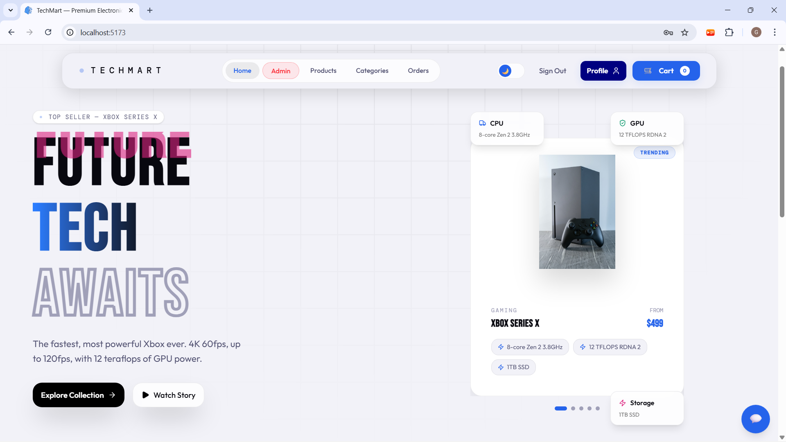
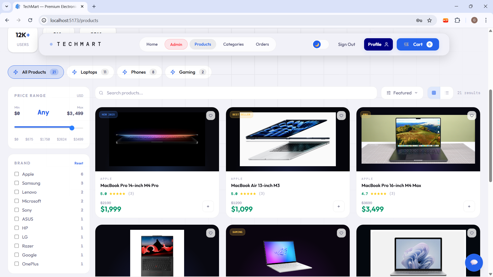
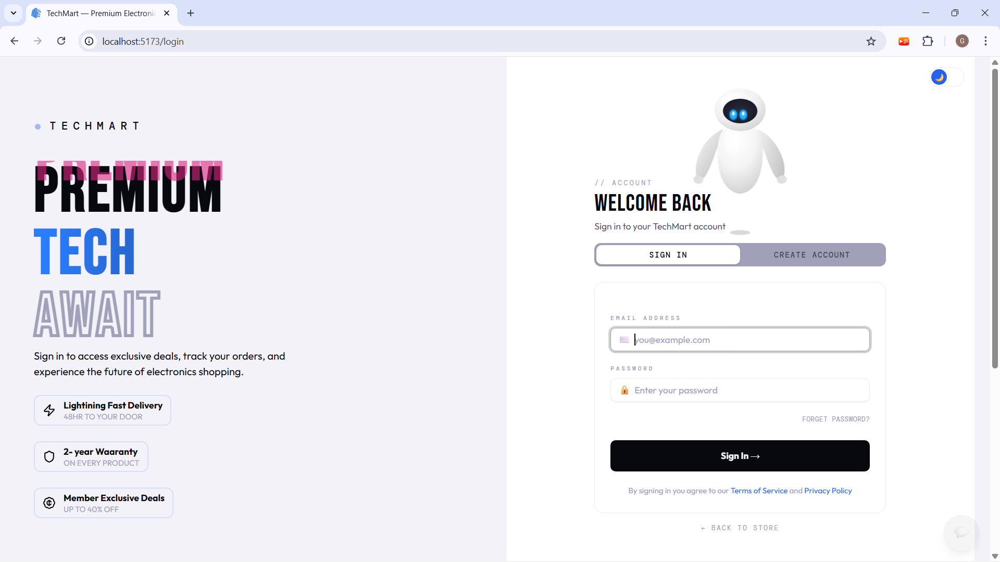
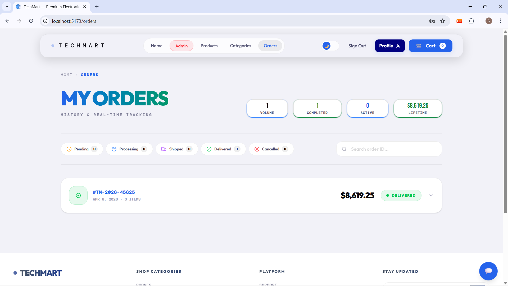
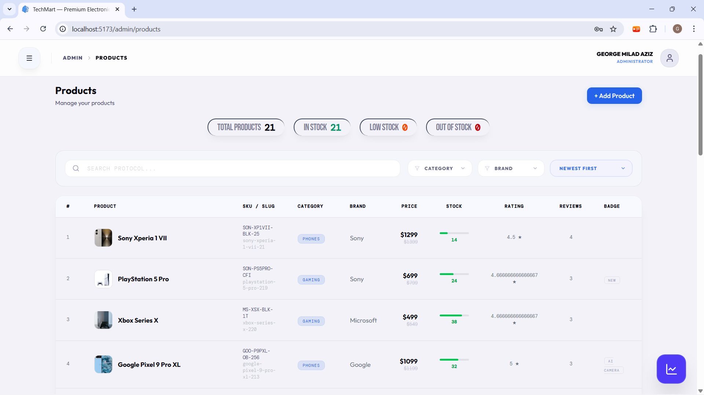
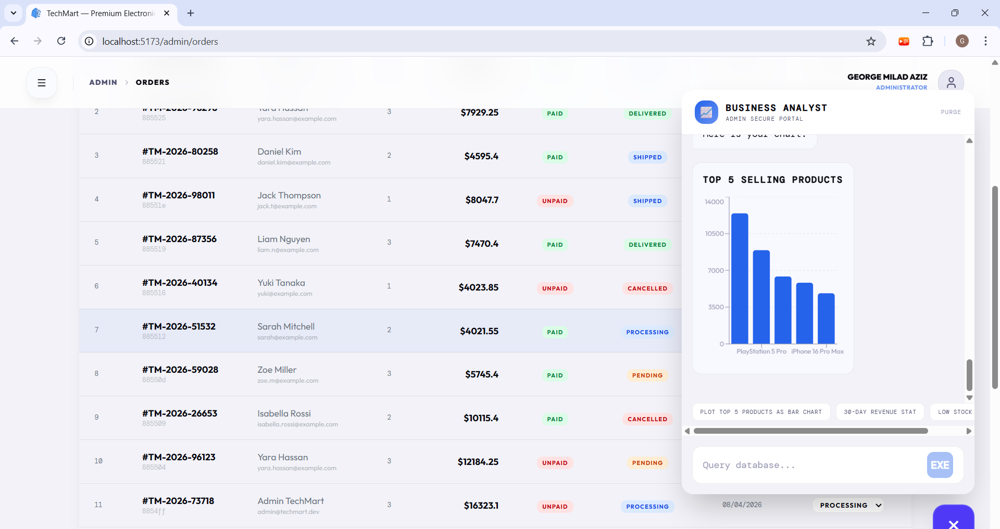

<div align="center">

# ⚡ TechMart — Premium E-Commerce Platform

### A full-stack e-commerce experience powered by **Agentic AI**, built with React, Node.js, and Google Gemini

[](https://tech-mart-e1dv.vercel.app)
[](https://react.dev)
[](https://nodejs.org)
[](https://mongodb.com)
[](https://typescriptlang.org)
[](https://ai.google.dev)

</div>

---

## 📋 Table of Contents

- [Overview](#-overview)
- [Key Features](#-key-features)
- [Tech Stack](#-tech-stack)
- [Architecture](#-architecture)
- [API Reference](#-api-reference-38-endpoints)
- [Database Schema](#-database-schema)
- [AI System](#-ai-system)
- [Security](#-security)
- [Getting Started](#-getting-started)
- [Environment Variables](#-environment-variables)
- [Project Structure](#-project-structure)
- [Screenshots](#-screenshots)

---

## 🎯 Overview

TechMart is a **premium electronics e-commerce platform** featuring two autonomous AI assistants, a full admin dashboard, and a cyberpunk-inspired dark-mode UI. The platform demonstrates advanced full-stack engineering with real-world patterns including dual-mode cart synchronization, OTP-based password recovery, demo-safe deployment, and agentic AI that can autonomously search products, manage carts, and initiate checkouts.

**This is not a tutorial clone.** The product schema alone spans 15+ sub-schemas modeling variants, color swatches, specs, box contents, rating breakdowns, and related products — mirroring the data complexity of real e-commerce catalogs.

---

## ✨ Key Features

### 🛒 Consumer Experience
| Feature | Description |
|:---|:---|
| **Product Catalog** | Paginated grid/list views with real-time filtering by category, brand, price range, and star rating |
| **Product Detail Page** | Image gallery, configurable variants (storage/memory) with live price recalculation, quick specs grid, full specs tab, box contents, review section |
| **Smart Cart** | Dual-mode architecture: `localStorage` for guests, server-persisted for authenticated users, with automatic merge/sync on login |
| **Checkout Flow** | Multi-step checkout with address management, order summary, and payment method selection |
| **Order Tracking** | Full order history with status tracking (pending → processing → shipped → delivered) |
| **User Profile** | Profile management, multiple delivery addresses (CRUD), order history |
| **Category Browsing** | Dynamic category pages with animated cards and glow effects |
| **AI Shopping Assistant** | Natural language product search, personalized recommendations, autonomous cart management |

### 🔐 Authentication & Security
| Feature | Description |
|:---|:---|
| **JWT Authentication** | Secure httpOnly cookie-based auth with environment-aware `sameSite`/`secure` flags |
| **Email Verification** | Post-registration email confirmation via Nodemailer |
| **Password Reset** | OTP-based forgot-password flow (generate → verify → reset) with expiry |
| **Rate Limiting** | Request throttling on auth and AI endpoints to prevent abuse |
| **Input Validation** | Joi schema validation on all user-facing endpoints |
| **Demo Guard** | Middleware that protects the demo admin account from destructive operations while allowing full read access |

### 🎛️ Admin Portal
| Feature | Description |
|:---|:---|
| **Dashboard** | Revenue overview, order stats, user counts, recent activity |
| **Product Management** | Full CRUD with rich schema support (variants, specs, images) |
| **Order Management** | View all orders, update status (pending/processing/shipped/delivered/cancelled), mark as paid/delivered |
| **User Management** | View all users, promote/demote admin, delete users |
| **Category Management** | Create/update/delete product categories with validation |
| **AI Business Analyst** | Admin-only AI assistant for querying revenue, order metrics, and user analytics via natural language |

### 🎨 Design & UX
| Feature | Description |
|:---|:---|
| **Dark/Light Mode** | Full token-based theme system with smooth 400ms transitions |
| **Custom Design System** | 15+ CSS custom properties, 3 custom font stacks (Bebas Neue, Outfit, DM Mono) |
| **Glassmorphism UI** | Translucent cards, backdrop blur, neon accent glows |
| **Micro-Animations** | PowerGlitch effects, Framer Motion page transitions, floating icon animations, scroll-to-top |
| **Responsive Design** | Mobile-first layout with adaptive hero section, collapsible sidebar filters, touch-friendly interactions |
| **Custom Loader** | Animated page loader with TechMart branding |
| **Interactive Mascot** | SVG robot mascot on the login page that reacts to input focus (blinks, looks left, closes eyes for password) |

---

## 🛠️ Tech Stack

### Frontend
| Technology | Purpose |
|:---|:---|
| **React 19** | UI framework with latest features |
| **TypeScript 5.9** | Type-safe development |
| **Vite 7** | Build tooling and dev server |
| **Tailwind CSS 4** | Utility-first styling with `@theme` token system |
| **Redux Toolkit + RTK Query** | Global state management and server-state caching |
| **React Router 7** | Client-side routing with lazy loading |
| **Framer Motion** | Page transitions and micro-animations |
| **React Hook Form** | Form state management and validation |
| **Recharts** | Admin dashboard data visualization |
| **Lucide React** | Icon system |
| **PowerGlitch** | Cyberpunk glitch text effects |
| **Embla Carousel** | Touch-friendly product image carousels |

### Backend
| Technology | Purpose |
|:---|:---|
| **Node.js + Express 5** | REST API server |
| **TypeScript 5.9** | Type-safe server code |
| **MongoDB + Mongoose 9** | Database and ODM |
| **Google Gemini API** | Agentic AI with function-calling |
| **JSON Web Tokens** | Stateless authentication |
| **bcrypt.js** | Password hashing |
| **Joi** | Request validation schemas |
| **Nodemailer** | Transactional email (verification, password reset) |
| **express-rate-limit** | API rate limiting |

### Infrastructure
| Technology | Purpose |
|:---|:---|
| **Vercel** | Frontend and backend deployment |
| **MongoDB Atlas** | Cloud database |
| **Gmail SMTP** | Email delivery |

---

## 🏗️ Architecture

```
┌────────────────────────────────────────────────────────────────┐
│                        CLIENT (React)                          │
│                                                                │
│  ┌──────────┐  ┌───────────┐  ┌──────────┐  ┌──────────────┐ │
│  │  Pages   │  │Components │  │  Slices   │  │  AI Chat UI  │ │
│  │(15 views)│  │ (20+ UI)  │  │(RTK Query)│  │(Consumer/Adm)│ │
│  └────┬─────┘  └─────┬─────┘  └─────┬─────┘  └──────┬───────┘ │
│       └───────────────┴──────────────┴───────────────┘         │
│                           │ HTTP (REST)                        │
└───────────────────────────┼────────────────────────────────────┘
                            │
┌───────────────────────────┼────────────────────────────────────┐
│                       SERVER (Express)                         │
│                           │                                    │
│  ┌────────────────────────┼────────────────────────────────┐   │
│  │              Middleware Pipeline                         │   │
│  │  CORS → JSON → Cookie → Auth → DemoGuard → Validate    │   │
│  └────────────────────────┼────────────────────────────────┘   │
│                           │                                    │
│  ┌────────────┐  ┌───────┴──────┐  ┌──────────────────────┐   │
│  │   Routes   │  │ Controllers  │  │    AI Services        │   │
│  │ (5 files)  │  │  (5 files)   │  │ ┌────────────────┐   │   │
│  └──────┬─────┘  └──────┬───────┘  │ │Consumer AI     │   │   │
│         │               │          │ │ - 6 source files│   │   │
│         │               │          │ │ - Function call │   │   │
│         │               │          │ │ - Model fallback│   │   │
│         │               │          │ ├────────────────┤   │   │
│         │               │          │ │Admin AI        │   │   │
│         │               │          │ │ - 6 source files│   │   │
│         │               │          │ │ - Revenue query │   │   │
│         │               │          │ │ - User analytics│   │   │
│         │               │          │ └────────────────┘   │   │
│         │               │          └──────────────────────┘   │
│         └───────────────┼────────────────────────────────────  │
│                         │                                      │
│  ┌──────────────────────┼──────────────────────────────────┐   │
│  │                  MongoDB Atlas                          │   │
│  │  Users · Products · Orders · Carts · Categories         │   │
│  └─────────────────────────────────────────────────────────┘   │
└────────────────────────────────────────────────────────────────┘
```

---

## 📡 API Reference (38 Endpoints)

### 🧑‍💻 Authentication & Users (15 endpoints)

| Method | Endpoint | Access | Description |
|:---|:---|:---|:---|
| `POST` | `/api/signUp` | Public | Register new user |
| `POST` | `/api/signIn` | Public | Login with email/password |
| `POST` | `/api/logout` | Public | Clear auth cookie |
| `GET` | `/api/verify-email/:email` | Public | Confirm email address |
| `POST` | `/api/forgetPassword` | Public | Send OTP to email |
| `POST` | `/api/verifyOtp` | Public | Verify OTP code |
| `POST` | `/api/resetPassword` | Public | Reset password with OTP |
| `GET` | `/api/profile` | Private | Get current user profile |
| `PUT` | `/api/profile` | Private | Update name/email/password |
| `POST` | `/api/profile/address` | Private | Add delivery address |
| `PUT` | `/api/profile/address` | Private | Update delivery address |
| `DELETE` | `/api/profile/address/:id` | Private | Delete delivery address |
| `GET` | `/api/allUsers` | Admin | List all users |
| `PUT` | `/api/:id` | Admin | Update user role |
| `DELETE` | `/api/:id` | Admin | Delete user |

### 📦 Products (9 endpoints)

| Method | Endpoint | Access | Description |
|:---|:---|:---|:---|
| `GET` | `/api/products` | Public | Get all products |
| `GET` | `/api/products/top` | Public | Get top-selling products |
| `GET` | `/api/products/:id` | Public | Get single product |
| `POST` | `/api/products` | Admin | Create product |
| `PUT` | `/api/products/:id` | Admin | Update product |
| `DELETE` | `/api/products/:id` | Admin | Delete product |
| `POST` | `/api/products/:id/reviews` | Private | Submit review |
| `GET` | `/api/products/:id/reviews` | Public | Get product reviews |

### 🛒 Cart (7 endpoints)

| Method | Endpoint | Access | Description |
|:---|:---|:---|:---|
| `GET` | `/api/cart` | Private | Get user's cart |
| `POST` | `/api/cart` | Private | Add item to cart |
| `DELETE` | `/api/cart/:id` | Private | Remove item from cart |
| `POST` | `/api/cart/sync` | Private | Sync localStorage cart to DB |
| `DELETE` | `/api/cart` | Private | Clear entire cart |
| `GET` | `/api/cart/admin` | Admin | Get all carts |
| `DELETE` | `/api/cart/admin/:id` | Admin | Delete cart by ID |

### 📋 Orders (7 endpoints)

| Method | Endpoint | Access | Description |
|:---|:---|:---|:---|
| `POST` | `/api/orders` | Private | Create new order |
| `GET` | `/api/orders/mine` | Private | Get my orders |
| `GET` | `/api/orders/:id` | Private | Get order by ID |
| `GET` | `/api/orders` | Admin | Get all orders |
| `PUT` | `/api/orders/:id/deliver` | Admin | Mark as delivered |
| `PUT` | `/api/orders/:id/pay` | Admin | Mark as paid |
| `PUT` | `/api/orders/:id/status` | Admin | Update order status |

### 🏷️ Categories (4 endpoints)

| Method | Endpoint | Access | Description |
|:---|:---|:---|:---|
| `GET` | `/api/categories` | Public | Get all categories |
| `POST` | `/api/categories` | Admin | Create category |
| `PUT` | `/api/categories/:id` | Admin | Update category |
| `DELETE` | `/api/categories/:id` | Admin | Delete category |

### 🤖 AI (2 endpoints)

| Method | Endpoint | Access | Description |
|:---|:---|:---|:---|
| `POST` | `/api/ai/chat` | Private | Consumer AI assistant |
| `POST` | `/api/admin-ai/chat` | Admin | Admin AI business analyst |

---

## 🗄️ Database Schema

### Product Model (15+ sub-schemas)
The product schema is the most complex entity, modeling real e-commerce data:

```
Product
├── Core: name, slug, brand, category, SKU, tags, description
├── Media: images[] { url, alt, isPrimary }
├── Pricing: price, originalPrice, currency
├── Stock: countInStock, soldCount
├── Variants: variantGroups[] { name, options[] { label, value, priceModifier, inStock } }
├── Colors: colors[] { name, hex }
├── Quick Specs: quickSpecs[] { icon, label, value }
├── Full Specs: specs[] { icon, label, value, description }
├── Box Items: boxItems[] { icon, name, quantity }
├── Reviews: reviews[] { user, name, title, rating, comment, timestamps }
├── Rating: rating, numReviews, ratingBreakdown { five, four, three, two, one }
├── Delivery: deliveryDate, returnDays, warrantyYears
├── Card Appearance: cardBgColor, cardGlowColor
└── Related Products: relatedProducts[] { product, name, brand, price, badge, image, category }
```

### Other Models
- **User**: name, email, password, isAdmin, delivery addresses[], OTP fields, AI usage stats
- **Order**: orderItems[], shippingAddress, paymentMethod, pricing breakdown, status tracking, timestamps
- **Cart**: cartItems[], pricing totals, user reference
- **Category**: name, slug, color, glowColor

---

## 🤖 AI System

TechMart features **two independent agentic AI systems** powered by Google Gemini with function-calling:

### Consumer AI — "TechAssistant"
Acts as a personal shopping concierge that can:
- **Search products** by name, brand, or natural language intent ("best laptop for video editing")
- **Add items to cart** autonomously when requested
- **View and manage cart** contents
- **Initiate checkout** — redirects the user to the secure checkout flow
- **Answer product questions** using only data from the TechMart catalog (no hallucination)

### Admin AI — "Business Analyst"
Acts as a data analyst for store administrators:
- **Query revenue** and order statistics
- **Analyze user metrics** and growth
- **Report on product performance** and inventory
- **Generate insights** from store data

### AI Architecture
```
User Message → Model Selection (4-model fallback chain)
             → Gemini processes with function definitions
             → If function call detected:
                → Execute function (DB query, cart action, etc.)
                → Feed result back to Gemini
                → Return natural language response + structured data
             → If rate-limited (429) or overloaded (503):
                → Fallback to next model in chain
                → Sleep 500ms between retries
```

**Model Fallback Chain**: `gemini-3.1-flash-lite` → `gemini-2.5-flash-lite` → `gemini-2.5-flash` → `gemini-3-flash`

### Chat Persistence
Both AI chat interfaces persist conversation history to `localStorage` using user-specific keys, enabling seamless session-independent conversations.

---

## 🔐 Security

| Layer | Implementation |
|:---|:---|
| **Authentication** | JWT stored in httpOnly cookies (not localStorage) |
| **Cookie Config** | `secure: true` + `sameSite: none` in production; `strict` in development |
| **Password Hashing** | bcrypt with salt rounds |
| **Rate Limiting** | `express-rate-limit` on auth and AI endpoints |
| **Input Validation** | Joi schemas on registration, login, password reset, category CRUD |
| **CORS** | Whitelist of specific allowed origins |
| **Admin Authorization** | Two-layer middleware: `protect` (auth) → `admin` (role check) |
| **Demo Protection** | `demoGuard` middleware blocks PUT/DELETE/POST for demo account |
| **Proxy Trust** | `trust proxy` enabled for Vercel reverse proxy |

---

## 🚀 Getting Started

### Prerequisites
- Node.js 18+
- MongoDB Atlas account (or local MongoDB)
- Google Gemini API key
- Gmail account (for SMTP)

### Installation

```bash
# Clone the repository
git clone https://github.com/George-lab2004/TechMart.git
cd TechMart

# Install backend dependencies
cd Backend
npm install

# Install frontend dependencies
cd ../Frontend
npm install
```

### Running Locally

```bash
# Terminal 1 — Backend
cd Backend
npm run dev

# Terminal 2 — Frontend
cd Frontend
npm run dev
```

The frontend runs on `http://localhost:5173` and the backend on `http://localhost:8000`.

### Seeding Data

```bash
cd Backend

# Seed products
npm run data:import

# Seed realistic phone data
npx tsx seeder-realistic-phones.ts
```

---

## 🔑 Environment Variables

### Backend (`Backend/.env`)

```env
PORT=8000
NODE_ENV=development
MONGO_URI=mongodb+srv://<username>:<password>@<cluster>.mongodb.net/<db>
JWT_SECRET=your_jwt_secret_key
GEMINI_API_KEY=your_google_gemini_api_key
EMAIL_USER=your_gmail@gmail.com
EMAIL_PASS=your_gmail_app_password
```

---

## 📁 Project Structure

```
TechMart/
├── Backend/
│   ├── ai/                    # Consumer AI (service, controller, route, definitions, functions, types)
│   ├── adminAi/               # Admin AI (same structure)
│   ├── config/                # Database connection
│   ├── controller/            # Route handlers (5 controllers)
│   ├── data/                  # Seed data
│   ├── emails/                # Email templates and service
│   ├── Middleware/             # Auth, demo guard, rate limiter, error handler, validator
│   ├── Models/                # Mongoose schemas (5 models)
│   ├── routes/                # Express routers (5 route files)
│   ├── validators/            # Joi validation schemas
│   ├── types/                 # TypeScript type extensions
│   └── server.ts              # App entry point
│
├── Frontend/
│   ├── src/
│   │   ├── AI/                # AI chat components (consumer + admin)
│   │   ├── Components/        # Shared UI (Header, Footer, Carousel, Loader, Mascot, etc.)
│   │   ├── layouts/           # UserLayout + AdminLayout
│   │   ├── pages/
│   │   │   ├── Home/          # Landing page with hero, carousel, floating icons
│   │   │   ├── Products/      # Catalog with filters, sort, grid/list toggle
│   │   │   ├── ProductDetails/# Full product page with specs, reviews, variants
│   │   │   ├── Cart/          # Shopping cart
│   │   │   ├── checkout/      # Multi-step checkout
│   │   │   ├── orders/        # Order history
│   │   │   ├── Profile/       # User profile + addresses
│   │   │   ├── authentication/# Login, register, forgot password, email verify
│   │   │   ├── categories/    # Category browsing
│   │   │   └── admin/         # Dashboard, Products, Orders, Users, Categories
│   │   ├── slices/            # Redux Toolkit slices + RTK Query API slices
│   │   ├── store/             # Redux store configuration
│   │   ├── lib/               # Utility libraries
│   │   ├── utils/             # Helper functions
│   │   └── index.css          # Design system (tokens, themes, animations)
│   └── package.json
│
└── README.md
```

---

## 📸 Screenshots

### Homepage
The hero section features a dynamic product carousel with floating spec cards, glitch text effects, and adaptive content that updates based on the active slide.



### Product Catalog
Full-featured catalog with sidebar filters (price range, brand, rating), category tabs, search, sort options, and grid/list view toggle.



### Authentication
Split-screen login page with interactive robot mascot that reacts to user input — blinks, looks toward the email field, and closes its eyes during password entry.



### Order History
User order tracking with status filters (Pending, Processing, Shipped, Delivered, Cancelled), lifetime spending stats, and expandable order details.



### Admin — Product Management
Full admin product table with stock indicators, rating display, category badges, SKU tracking, and inline search/filter by category and brand.



### Admin — AI Business Analyst & Order Management
The admin AI assistant generates live Recharts visualizations (bar, line, pie) from real database queries. Shown here alongside the order management table with status controls.



---

## 📊 Project Stats

| Metric | Count |
|:---|:---|
| **API Endpoints** | 38 |
| **Database Models** | 5 |
| **Frontend Pages** | ~15 unique views |
| **React Components** | 50+ |
| **AI Systems** | 2 (Consumer + Admin) |
| **AI Function Definitions** | 12+ agentic functions |
| **CSS Custom Properties** | 30+ design tokens |
| **Lines of AI Prompt Engineering** | ~200+ (system instructions) |

---

## 👤 Author

**George** — Full-Stack Developer

- GitHub: [@George-lab2004](https://github.com/George-lab2004)

---

<div align="center">

Built with ☕ and a lot of TypeScript

</div>

